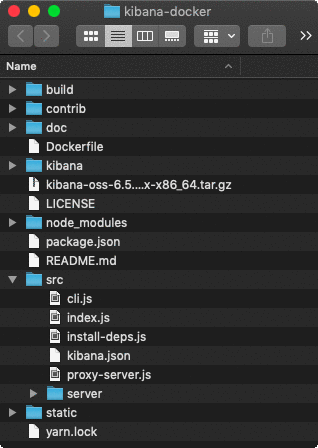

# kibana-docker

The Shell Commands And Node Scripts Used To Create The `artdeco/kibana` Image In A Dockerfile.

The problem with the official _Kibana_ image is that it contains all `node_modules`, even the dev dependencies. In addition, the Webpack is so integrated into _Kibana_ that it is required in the production version also, however it does not do anything because the front-end bundles have been pre-compiled. This project removes all unnecessary Babel, React, Webpack & co evil from the distributed image by finding out what dependencies are really needed and thus producing the most minimal built that is not shameful to run in a container.

The image also adds an authorisation level by running an http proxy server to access _Kibana_.



## Dockerfile

We use the *Multi-Stage Build* to create an optimized version of the image.

```docker
## Stage 0: Prepare Kibana
FROM node:alpine as builder

# 1. Download 6.6.0-snapshot and strip node and node_modules
RUN wget -qO- https://snapshots.elastic.co/downloads/kibana/kibana-oss-6.6.0-SNAPSHOT-linux-x86_64.tar.gz | tar xz

RUN mv kibana-6.6.0-SNAPSHOT-linux-x86_64 kibana
WORKDIR /kibana
RUN mkdir packages
# Keep the required modules built from  the monorepo
RUN cp -R node_modules/\@kbn/config-schema/ packages/kbn-config-schema
RUN cp -R node_modules/\@kbn/datemath/ packages/kbn-datemath
RUN cp -R node_modules/\@kbn/i18n/ packages/kbn-i18n
# Runnable code is in target therefore src is unrequired
RUN rm -rf packages/kbn-config-schema/src packages/kbn-datemath/src packages/kbn-i18n/src
RUN rm -rf node node_modules

# 2. Add the package.json and yarn.lock files that we've generated.
ADD contrib/package.json package.json
ADD contrib/yarn.lock yarn.lock

# 3. Download and install node_modules.
RUN yarn

# 4. Patch the source code:
# remove Optimize mixin and __REPLACE_WITH_PUBLIC_PATH__
ADD build/server/kbn_server.js src/server/kbn_server.js
RUN find optimize -type f -exec sed -i -e 's/__REPLACE_WITH_PUBLIC_PATH__//g' {} \;

# STAGE 2: Setup Proxy
FROM node:alpine
COPY --from=builder kibana kibana

ADD package.json .
ADD yarn.lock .
RUN yarn --production

# Add The Login Screen
ADD static static

ADD build/cli.js build/cli.js
ADD build/proxy-server.js build/proxy-server.js

ENV NODE_ENV production

# Same entrypoint as prev version.
ENTRYPOINT node build/cli -e http://$ELASTIC_SEARCH:9200 -q
```

## Development Version

The dev environment for reproduction locally can be set-up by downloading the [snapshot Kibana](https://snapshots.elastic.co/downloads/kibana/kibana-oss-6.6.0-SNAPSHOT-linux-x86_64.tar.gz) and extracting it to the `kibana` directory. This will emulate Docker downloading it for us. There are 2 important steps to take:
- Then, the `kibana/src/server/kbn_server.js` needs to be updated with the patched version that removes the _Optimize_ plugin from `build/server/kbn_server.js`.
- 9 vendor files from `kibana/optimize` need `__REPLACE_WITH_PUBLIC_PATH__` replaced to an empty string.

Our `build/cli.js` is a substitute to `kibana/src/cli/index.js` that skips babel setup. It will start the _Kibana_ server and the proxy server and it is the entry point of the application invoked with `yarn start`.

## Taken From Source

- [x] To find out the exact required dependencies' versions, the [kibana/v6.6.0/package.json](https://raw.githubusercontent.com/elastic/kibana/v6.6.0/package.json) file is taken from GitHub and put in th `src` as `kibana.json` for the use by `install-deps.js`.
- [x] The `src/server/kbn_server.js` is updated to remove the Optimize mixin.

## The `install-deps` Tool

The tool is used to find all missing dependencies by attempting to start the server, and failing, and extracting the missing module name and the file location where the error happened to display in CLI.


<!--
## `verify-versions`

This tool will fetch the `package.json` from GitHub, and compare the versions in the Kibana's `package.json` against the online values. The verification step can be required to make sure that there are no rogue dependencies in this image. -->
